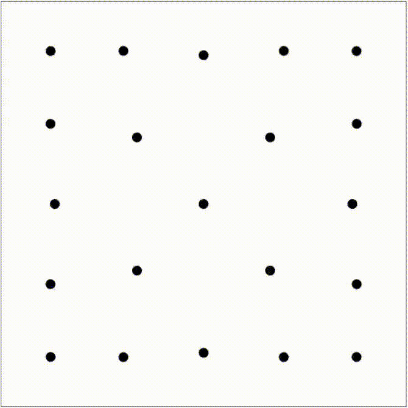

# OCDots

> OCDots is a javascript library for creating evenly distributed points inside a polygon

[](https://codecov.io/gh/luxedo/ocdots) [](https://www.codefactor.io/repository/github/luxedo/ocdots) [](https://badge.fury.io/js/ocdots) [](https://www.gnu.org/licenses/gpl-3.0)



## Quick Start

OCDots uses physics to maximize the distance between each point and
also the distance to the walls of a polygon. It is possible to follow
each step of the process calling `movePoints`, or call `relaxPoints`
to run several iterations and see the final state.

Import the library, then call `movePoints` on a set of points to run
one iteration

```javascript
const polygon = [
  [0, 0],
  [0, 500],
  [500, 500],
  [500, 0],
  [0, 0],
];
const points = [
  [10, 10],
  [20, 20],
  [30, 30],
  [40, 40],
  [50, 50],
  [60, 60],
  [70, 70],
  [80, 80],
  [90, 91],
];
let momentum = points.map(() => [0, 0]);
const newPoints = movePoints({
  points,
  momentum,
  polygon,
}); // Points closer to the relaxed position
// newPoints:
// [[13.535794548720887, 13.535273243928348],
// [23.27147728369301, 23.266677836465515],
// [31.254830565917008, 31.24699231498995],
// [41.28615235332842, 41.272681142242014],
// [51.958871850605114, 51.93302052874113],
// [63.120940102952105, 63.061513386276076],
// [73.60106973613009, 73.4687601178992],
// [83.7612857566466, 83.29434810802492],
// [93.40654447613721, 94.65998015460454]]
```

Or call `relaxPoints` to run several iterations:

```javascript
const polygon = [
  [0, 0],
  [0, 500],
  [500, 500],
  [500, 0],
  [0, 0],
];
const points = [
  [10, 10],
  [20, 20],
  [30, 30],
  [40, 40],
  [50, 50],
  [60, 60],
  [70, 70],
];
const iterations = 600;
const newPoints = relaxPoints({
  points,
  polygon,
  iterations,
}); // Points closer to the relaxed position, 600 iterations
// newPoints:
// [[102.97786539754973, 102.93913654344668],
// [249.88751973067804, 95.97842402445758],
// [95.85157380539883, 249.581118685883],
// [249.83589254388568, 250.64858636270534],
// [103.38882973892018, 396.3498058144843],
// [396.8795797129724, 103.0543405820668],
// [249.77618266302204, 404.4383179086723],
// [404.0862954198404, 249.7401659115181],
// [396.995879400969, 396.84327821075937]]
```

## Install

Install with npm:

```bash
npm install ocdots
```

To use with node just import the module:

```javascript
const ocdots = require("ocdots");
ocdots.movePoints(...);
```

In the browser import the script and then

```html
<script src="node_modules/ocdots/ocdots.js"></script>
<script>
  movePoints(...);
</script>
```

You can also [download](https://raw.githubusercontent.com/luxedo/OCDots/master/ocdots.js)
the file and import as you prefer. No extra dependencies are required.

## Usage

Please check the functions signatures and description in the
[source](https://raw.githubusercontent.com/luxedo/OCDots/master/ocdots.js).

A running example can be found [here](https://luxedo.github.io/OCDots/).

## License

> SPOS - Small Payload Object Serializer
> Copyright (C) 2020 Luiz Eduardo Amaral <luizamaral306@gmail.com>
>
> This program is free software: you can redistribute it and/or modify
> it under the terms of the GNU General Public License as published by
> the Free Software Foundation, either version 3 of the License, or
> (at your option) any later version.
>
> This program is distributed in the hope that it will be useful,
> but WITHOUT ANY WARRANTY; without even the implied warranty of
> MERCHANTABILITY or FITNESS FOR A PARTICULAR PURPOSE. See the
> GNU General Public License for more details.
>
> You should have received a copy of the GNU General Public License
